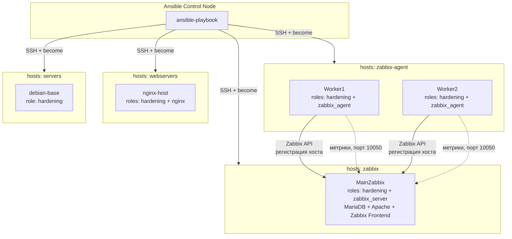

# ansible_templates


Набор Ansible-плейбуков и ролей для эксплуатации небольшого Linux-стенда:
базовый хардненинг серверов, разворачивание Nginx и полный цикл установки
Zabbix Server + автоматическая регистрация агентов через Zabbix API.

## Архитектура стенда



## Структура репозитория

```
ansible_templates/
├── inventory.ini
├── playbook.yml
├── .env                      # не коммитится, см. "Секреты"
└── roles/
    ├── hardening/
    │   ├── defaults/main.yml
    │   ├── handlers/main.yml
    │   └── tasks/
    │       ├── main.yml
    │       ├── ssh.yml
    │       ├── user.yml
    │       └── auditd.yml
    ├── nginx/
    │   ├── defaults/main.yml
    │   ├── handlers/main.yml
    │   └── tasks/main.yml
    ├── zabbix_server/
    │   ├── defaults/main.yml
    │   ├── handlers/main.yml
    │   └── tasks/
    │       ├── main.yml
    │       ├── install_zabbix_server.yml
    │       └── conf_server.yml
    └── zabbix_agent/
        ├── defaults/main.yml
        ├── handlers/main.yml
        └── tasks/
            ├── main.yml
            ├── client.yml
            └── server.yml
```

## Плейбук

`playbook.yml` содержит четыре play:

| Play | Хосты (группа inventory) | Роли |
|---|---|---|
| Apply server hardening | `servers` | `hardening` |
| NginxConf | `webservers` | `hardening` (для nginx-хоста добавляется отдельно, см. ниже) → `nginx` |
| ZabbixConf | `zabbix` | `hardening`, `zabbix_server` |
| BaseConfig | `zabbix-agent` | `hardening`, `zabbix_agent` |

> Группы в `inventory.ini` должны называться ровно так, как в таблице выше
> (`servers`, `webservers`, `zabbix`, `zabbix-agent`) — иначе play молча
> применится к пустому списку хостов без ошибки. Пример корректного
> inventory — в разделе "Inventory" ниже.

## Роль `hardening`

Приводит сервер к базовому защищённому состоянию:

- **SSH** (`tasks/ssh.yml`) — установка `openssh-server`, деплой кастомного
  `sshd_config` из шаблона с валидацией конфига перед применением
  (`sshd -t`), запуск и автозагрузка службы.
- **Административный пользователь** (`tasks/user.yml`) — создание
  пользователя (`ssh_admin_user`), добавление в группу `sudo`, создание
  `~/.ssh` с правами `0700` и установка публичного SSH-ключа через
  `authorized_key`.
- **Аудит журналов** (`tasks/auditd.yml`) — установка `auditd` и
  `audispd-plugins`, деплой правил аудита (`base.rules`), запуск и
  автозагрузка `auditd`.

### Переменные по умолчанию (`roles/hardening/defaults/main.yml`)

| Переменная | Значение по умолчанию | Описание |
|---|---|---|
| `ssh_port` | `22` | Порт SSH |
| `ssh_admin_user` | `admin` | Имя создаваемого администратора |
| `ssh_public_key` | `ssh-ed25519 ...` | Публичный ключ для входа |
| `ssh_allowed_users` | `[k4ips, admin]` | Пользователи, которым разрешён вход по SSH |

### Хендлеры

- `Restart SSH`
- `Restart auditd`
- `Reload audit rules` (`augenrules --load`)

### Известные ограничения

- Пользователю `ssh_admin_user` выдаётся passwordless sudo
  (`NOPASSWD: ALL`) — удобно для автоматизации, но само по себе снижает
  защищённость. На реальном стенде стоит выдавать sudo с паролем и
  оставлять `NOPASSWD` только для узкого набора команд.
- `ssh_allowed_users` пока не используется в шаблоне `sshd_config.j2`
  (директива `AllowUsers` не прокинута) — в планах.

## Роль `nginx`

- Устанавливает пакет `nginx`.
- Проверяет/запускает и включает автозагрузку сервиса.
- Деплоит `index.html` и конфиг `sites-available/default` из шаблонов
  Jinja2 (`index.html.j2`, `default.j2`).
- При изменении шаблонов вызывает хендлер `Restart Nginx`.

### Переменные по умолчанию (`roles/nginx/defaults/main.yml`)

| Переменная | Значение по умолчанию | Описание |
|---|---|---|
| `nginx_port` | `80` | Порт nginx |
| `main_page_word` | `ANSIBLE MANAGE THIS` | Текст на главной странице |

## Роль `zabbix_server`

Полная установка Zabbix Server 7.0 на Debian/Ubuntu:

- Ставит официальный `.deb`-репозиторий Zabbix (`deb_repo_url`).
- Устанавливает `mariadb-server`, `zabbix-server-mysql`,
  `zabbix-frontend-php`, `zabbix-apache-conf`, `zabbix-sql-scripts`,
  `zabbix-agent`, `python3-pymysql`.
- Создаёт БД `zabbix` (utf8mb4) и пользователя БД с правами `ALL`.
- Включает `log_bin_trust_function_creators` — требование для
  корректной установки хранимых процедур Zabbix.
- Идемпотентно накатывает SQL-схему: сначала проверяет, есть ли уже
  таблица `users`, и импортирует `server.sql.gz` только если БД пустая.
- Деплоит `zabbix_server.conf` и `zabbix.conf.php` из шаблонов.
- Меняет пароль пользователя `Admin` в веб-интерфейсе на значение из
  `.env` (хэшируется через `password_hash("bcrypt")` прямо в Jinja2).

### Переменные (`roles/zabbix_server/defaults/main.yml`)

Все обязательные переменные читаются из локального `.env` через
`lookup('ansible.builtin.ini', ..., file='.env')` — в репозитории их
значений нет:

| Переменная | Источник | Описание |
|---|---|---|
| `zabbix_db_password` | `.env` | Пароль пользователя БД `zabbix` |
| `zabbix_server_name` | `.env` | Имя Zabbix-сервера |
| `zabbix_admin_password` | `.env` | Пароль веб-пользователя `Admin` |
| `zabbix_admin_password_hash` | `.env` | Резервный bcrypt-хэш (если используется отдельно от `password_hash`) |
| `deb_repo_url` | задан в роли | URL `.deb`-пакета репозитория Zabbix 7.0 |

### Хендлеры

- `Restart apache and zabbixs units` — перезапускает и включает
  `zabbix-server`, `zabbix-agent`, `apache2` одним циклом (`loop`).

### Известные ограничения

- Пароль БД передаётся в `mariadb -u zabbix -p'...'` через command line —
  виден в выводе `ps aux` во время выполнения. Для продакшена лучше
  использовать `~/.my.cnf` (0600) или `mysql_config_editor`.

## Роль `zabbix_agent`

- Проверяет, что `.env` существует, иначе явно падает с понятной
  ошибкой (`delegate_to: localhost`, `run_once: true`).
- **Client (`tasks/client.yml`)** — ставит `zabbix-agent`, деплоит
  `zabbix_agentd.conf` из шаблона.
- **Server-side регистрация (`tasks/server.yml`)** — регистрирует хост
  в Zabbix через `community.zabbix.zabbix_host` (Zabbix API), подключаясь
  к `zabbix_server_ip` под `Admin`. Автоматически привязывает шаблон
  `Linux by Zabbix agent` и группу `Linux servers`, задаёт agent-интерфейс
  на порту `10050`.

### Переменные (`roles/zabbix_agent/defaults/main.yml`)

| Переменная | Источник | Описание |
|---|---|---|
| `zabbix_server_ip` | `.env` | IP Zabbix-сервера для обращения к API |
| `zabbix_admin_password` | `.env` | Пароль `Admin` для HTTP API |

### Хендлеры

- `RestartEnableAgent`

## Inventory

Пример `inventory.ini`, где группы совпадают с `hosts:` из `playbook.yml`:

```ini
[servers]
debian-base ansible_host=192.168.122.10 ansible_user=admin ansible_ssh_private_key_file=./adminkey ansible_ssh_common_args='-o IdentitiesOnly=yes'

[webservers]
debian-base2 ansible_host=192.168.122.11 ansible_user=admin ansible_ssh_private_key_file=./adminkey ansible_ssh_common_args='-o IdentitiesOnly=yes'

[zabbix]
MainZabbix ansible_host=192.168.122.185 ansible_user=admin ansible_ssh_private_key_file=./adminkey ansible_ssh_common_args='-o IdentitiesOnly=yes'

[zabbix-agent]
Worker1 ansible_host=192.168.122.219 ansible_user=admin ansible_ssh_private_key_file=./adminkey ansible_ssh_common_args='-o IdentitiesOnly=yes'
Worker2 ansible_host=192.168.122.246 ansible_user=admin ansible_ssh_private_key_file=./adminkey ansible_ssh_common_args='-o IdentitiesOnly=yes'
```

## Секреты (`.env`)

Роли `zabbix_server` и `zabbix_agent` требуют файл `.env` рядом с
`playbook.yml` (в репозиторий не коммитится, добавлен в `.gitignore`):

```ini
zabbix_db_password=change_me
zabbix_server_name=MainZabbix
zabbix_admin_password=change_me_too
zabbix_admin_password_hash=
zabbix_server_ip=192.168.122.185
```

Если файла нет — плейбук явно падает на первом же таске с понятным
сообщением, а не проваливается где-то посередине установки.

## Использование

1. Отредактируйте `inventory.ini` под свои хосты и путь к приватному
   ключу.
2. Создайте `.env` по примеру выше.
3. При необходимости переопределите переменные ролей (`ssh_admin_user`,
   `ssh_public_key` и т. д.) в `group_vars` / `host_vars` или через `-e`.
4. Запустите плейбук:

```bash
ansible-playbook -i inventory.ini playbook.yml
```

Прогнать только одну роль/группу хостов:

```bash
ansible-playbook -i inventory.ini playbook.yml --limit zabbix-agent
ansible-playbook -i inventory.ini playbook.yml --tags hardening
```

## Требования

- Ansible ≥ 2.10
- Коллекции: `community.mysql`, `community.zabbix`
- Целевые хосты — Debian/Ubuntu
- SSH-доступ с правами на `become` (sudo)

## Roadmap

- [ ] Тэги на тасках (`hardening`, `nginx`, `zabbix`) для выборочного запуска
- [ ] GitHub Actions: `ansible-lint` + `ansible-playbook --syntax-check` на каждый push
- [ ] Молекулярные тесты (`molecule` + Docker) для роли `hardening`
- [ ] Прокинуть `ssh_allowed_users` в `sshd_config.j2` (`AllowUsers`)
- [ ] Убрать пароль БД из командной строки в `install_zabbix_server.yml`
- [ ] Опциональный sudo с паролем вместо `NOPASSWD: ALL`

## Лицензия

Не указана.